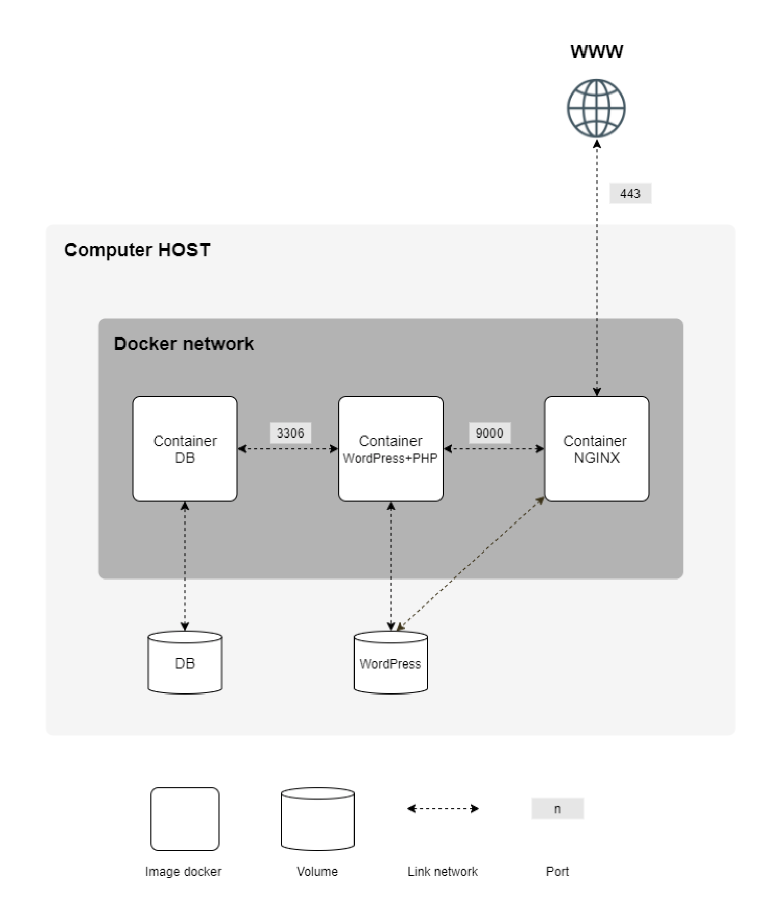

# Inception Project

The aim of the project is to automate the deployment of a WordPress website with MariaDB as database and Nginx as web server, all in Docker containers using Docker Compose.

## Diagram



## Prerequisites

- Docker
- Docker Compose

## Installation and Setup

1. Clone this repository to your local machine
2. Create a copy of the `.env.example` file and name it `.env`
```bash
cp srcs/.env.example srcs/.env
```
3. Open the `.env` file in a text editor and configure the environment variables as needed. You can customize database credentials, WordPress settings, and more.
4. Build and start the Docker containers:
```bash
make up
```
5. Your WordPress site should now be accessible at https://localhost. You can access the WordPress admin panel at https://localhost/wp-admin using the credentials you specified in the .env file.


